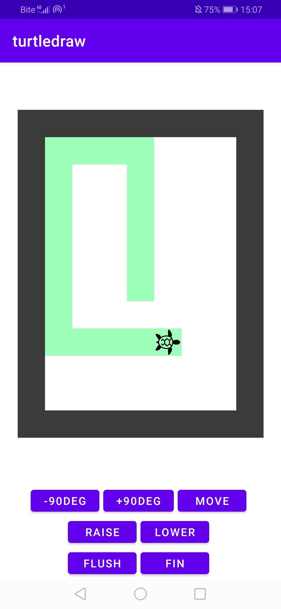

# Turtledraw
This is an exercise Android project for an OOP course at uni.
You control a turtle that leaves a trace wherever it goes.
Every grid cell is a `View`, the turtle is an `ImageView`.
Every move triggers a re-render of all grid cells, which is inefficient, but didn't matter in the scope of this project.

## Usage
This project has no environment management. No docker, no Nix, no nothing.
Install Android Studio, attempt to compile this and hope for the best.

## Illustration
This is a screenshot of the app running on my phone.
  
